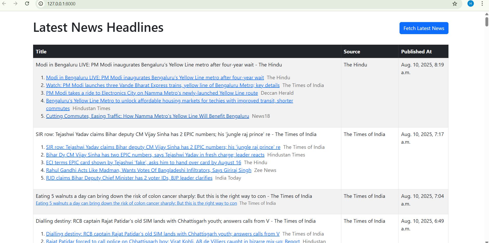

Auto News Fetcher & Dashboard (Project 2)

This is a simple Django-based web application that automates fetching the latest news headlines, stores them in a database, and displays them on a clean, user-friendly dashboard.

---
## Screenshot

Here is a sample of the working user interface.

<!--

-->


---
## Solution Explanation

This project is built with Python and the Django framework.

Backend: A Django model named `NewsArticle` is used to store headlines in a SQLite database. The application fetches news by parsing the Google News RSS feed, ensuring that duplicate articles are not saved.
Frontend: The dashboard is a simple Django template styled with Bootstrap. It displays the fetched articles and includes a button to manually trigger a fetch for the latest news.

---
## Setup Instructions

Follow these steps to set up and run the project locally.

1.  Clone the repository:
    ```bash
    git clone [https://github.com/harshkrishnani/news-dashboard.git](https://github.com/harshkrishnani/news-dashboard.git)
    cd news-dashboard
    ```

2.  Create and activate a virtual environment:
    ```bash
    # Create the virtual environment
    python -m venv venv

    # Activate on Windows
    venv\Scripts\activate

    # Activate on macOS/Linux
    source venv/bin/activate
    ```

3.  Install the required dependencies:
    ```bash
    pip install -r requirements.txt
    ```

4.  Apply database migrations:
    ```bash
    python manage.py migrate
    ```

5.  Run the development server:
    ```bash
    python manage.py runserver
    ```
    Open your web browser and go to `http://127.0.0.1:8000/` to see the application.

---
## How to Fetch News

You can fetch the latest news in two ways.

1.  Manual Fetch via UI:
    * Navigate to the main dashboard page.
    * Click the "Fetch Latest News" button to get the newest headlines immediately.

2.  Manual Fetch via Command Line:
    * You can also use the custom management command.
    * In your terminal, run:
        ```bash
        python manage.py fetcharticles
        ````

---
###  Step 4: Commit the New File

1.  Scroll down below the text editor. You will see a section called Commit new file.
2.  You can leave the title as `Create README.md`.
3.  Click the green Commit new file button.

Your `README.md` file is now created and visible on your repository.

---
### ## Final Step: Update Your Local Project

Because you made a change on GitHub, your local computer is now out of date.

1.  Go to your **VS Code terminal**.
2.  Run this command to download the new `README.md` file to your project folder:
    ```bash
    git pull
    ```

You are now perfectly in sync.
